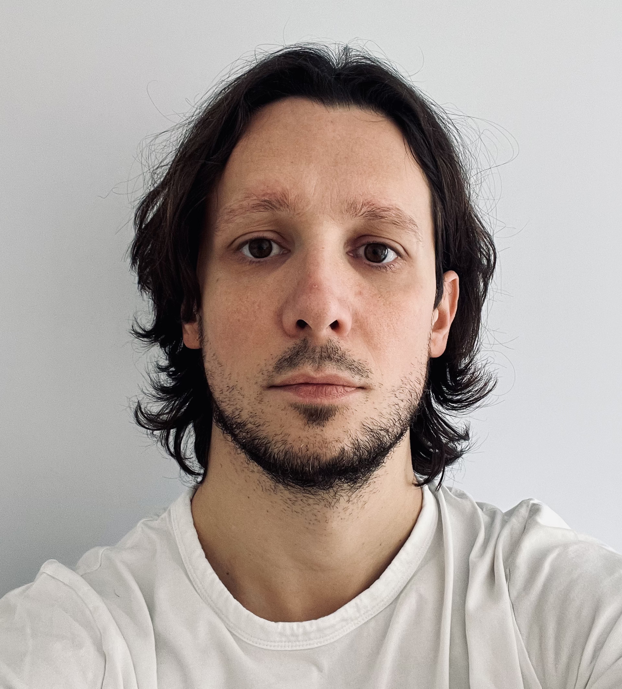

# Marcello Ziotti

## Contacts

- 🌐 **LinkedIn:** <https://www.linkedin.com/in/marcelloziotti>
- 📫 **Email:** [marcello.ziotti@gmail.com](mailto:marcello.ziotti@gmail.com)

## Work

### Intel Corporation - Ferrara (Italy) - (Apr 2022, Present)

#### Simulation and Modeling Engineer - Simics Simulator - Technical Lead

Building on my expertise in single-IP simulation, I took on SoC-level responsibilities, including interconnect updates, testing frameworks, and quality assurance. My contributions led to a promotion to Technical Lead, where I mentor colleagues and lead initiatives enhancing Intel's simulation platforms.

Key Contributions:

- 💻 **Pantherlake Simics SoC Ownership:** Updated the Intel IOSF Sideband interconnect network, drove the Simics enablement from UEFI/OS boot to more complex FW/SW features.
- 🚀 **Build System Modernization:** Spearheaded a cross-team transition from Make to CMake with Ninja for all SoC IPs, reducing build times by 70% (from 50 to 15 minutes).
- ✅ **Unit Testing Framework for Simics IPs:** Developed a unit test framework for Simics models and drove the adoption making unit tests mandatory for IP integration to Simics SOCs.
- 🔧 **Code Quality and TDD Integration:** Integrated code coverage monitoring into CI pipelines with a pre-commit check that prevents commits if coverage drops, promoting Test-Driven Development (TDD). Currently adopted by 30 IPs with coverage exceeding 90%.
- 🤝 **Technical Leadership:** Promoted to Technical Lead for contributions to simulation platforms and organizational efficiency. Mentored new hires and streamlined initiatives such as CMake migration, unit testing framework Simics models and code coverage check integrated into GitHub.

### Intel Corporation - Munich (Germany) - (Jul 2018, Apr 2022)

#### Simulation and Modeling Engineer - SystemC and Simics Simulator

Transitioning into simulation modeling, I worked on SystemC IPs, including Audio and Camera models for Alderlake and Meteorlake Simics platforms. I developed a security IP using Device Modeling Language (DML), collaborating with BIOS, firmware, and OS teams, fostering a strong partnership with Microsoft.

Key Contributions:

- 🔈 **Audio IP and Hardware Communication Interfaces (Meteorlake):** Evaluated with architect teams the integration of embedded system interfaces such as I2C, I3C, SPI, UART to the Audio IP Simics SystemC model.
- 🚀 **Build System Modernization:** Migrated the Audio IP build system from Make to CMake, achieving a 70% speedup in build times.
- 🔧 **Intel IOSF Sideband Interface SystemC Library Update:** Partnered with the Simics Simulator team the upgrade of the core Intel IOSF Sideband Interface SystemC library to meet new architecture specifications.
- 📷 **Camera IP 3rd Party Integration (Meteorlake):** Integrated into a Simics SystemC model the Camera SystemC model developed by the IP team. Owned the end-to-end Simics validation.
- 🔒 **NVMe Data Encryption Modeling (Lunarlake):** Created a new Simics DML (Device Modeling Language) model for NVMe data encryption. Adopted Test-Driven Development (TDD) and validated functionality with the BIOS team using UEFI applications, successfully shifting-left overall FW/SW/OS readiness.
- 🤝 **Collaboration with Microsoft:** Running NVMe encryption flows on Simics helped Microsoft to detect and fix three critical bugs in the Windows OS pre-release. Microsoft found a great value in Simics SoC simuation, and the collaboration is continuing also for the upcoming SoCs like Pantherlake.
- ⚙️ **Software Continuous Integration (SWCI) Initiative:** Initiated the SWCI project to integrate and test BIOS/FW components alongside Simics SoC builds. Enabled early identification of firmware issues and streamlined the integration process to upcoming SoCs like Pantherlake.

### Intel Corporation - Munich (Germany) - (Feb 2018, Jul 2018)

#### Design Verification Engineer

Contributed to Intel’s cellular 5G chip verification efforts, focusing on SystemVerilog and UVM methodologies. This role involved behavioral and power validation, ensuring the chip met design requirements. Key contributions included DMA backdoor access implementation for efficient component communication.

### Visiting Researcher at National University of Singapore (Jul 2017, Dec 2017)

Designed a programmable many-core architecture with SystemC for high-throughput, low-latency LTE base stations. Focused on real-time physical layer processing using SDR, addressing 5G challenges like 10x throughput increases. Integrated RTOS design with realistic 5G applications for end-to-end evaluation.

## Education

- 🎓 **MSc in Electrical and Telecommunication Engineering, University of Ferrara (Italy)**
- 🎓 **BSc in Electrical Engineering, University of Ferrara (Italy)**

## Skills

### Core Competencies

- 🧩 **Problem Solving & Initiative:** Embrace challenges and tackle complex tasks by identifying and addressing inefficiencies. Proactively improve workflows when opportunities arise.
- 🛠️ **Test-Driven Development (TDD) & Code Quality:** Strong advocate for unit testing, code coverage, and Test-Driven Development, ensuring the highest standards of quality across all projects.
- 📄 **Clear & Simple Code:** Believe that great code is sincere, unadorned, and free of unnecessary complexity. Committed to writing clear, maintainable, and scalable code that teams can easily build upon.
- 🤝 **Collaboration & Team Success:** My achievements are rooted in the success of the team. I enjoy mentoring, sharing knowledge, and learning from others, fostering a culture of growth and  improvement.
- ⚡ **Adaptability & Versatility:** Like to juggle among diverse tasks and open to explore new domains.
- ⚙️ **Continuous Integration (CI) & DevOps Collaboration:** Frequently collaborated with DevOps teams to enhance pipelines and practices for faster software deployment.

### Languages & Technical Skills

- 💻 **Technical Skills & Tools:**
  - Proficient: Python, Simics (System Simulation), DML & SystemC (Hardware Modeling), Git, CMake, Bash, Jenkins, GDB
  - Experienced: C++, C, Make, Csh, VTune, Valgrind
  - Familiar: VHDL, Verilog, SystemVerilog, QEMU, Assembly (ASM)
- 🌐 **Languages:** Italian (Native), English (Fluent), German (Intermediate), Spanish (Basic)

